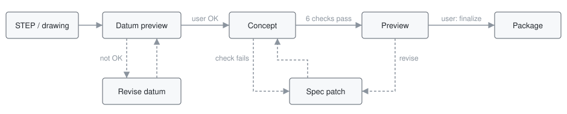
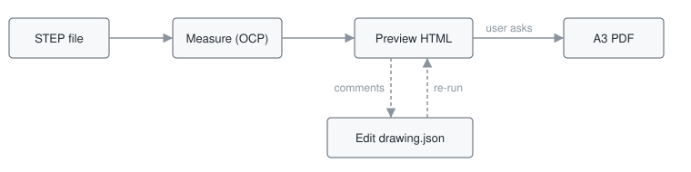

# BIXL Skills

Backwell IXL assistant skills. Each [release](../../releases) carries one skill as a zip with `SKILL.md` at its root, ready to upload to an assistant; unzip it into a named folder to install locally.

| Skill | Purpose |
|---|---|
| [design-fixture](#design-fixture) | Weld and checking fixtures from a STEP file or dimensioned drawing |
| [draft-drawing](#draft-drawing) | Draft A3 shop drawing of a sheet-metal part or weldment from a STEP file |
| [costing](#costing) | Sheet-metal fabrication cost estimate from a drawing or STEP file |

## design-fixture

[SKILL.md](design-fixture/SKILL.md) · local scripts need [`scripts/requirements.txt`](design-fixture/scripts/requirements.txt) (OCP 7.8.x)

**[Download design-fixture-v1.4.zip](../../releases/download/design-fixture-v1.4/design-fixture-v1.4.zip)** — `SKILL.md` at the zip root; unzip into a folder named `design-fixture`.

The checks: cap tabs, rib width, cross ribs, clamp plate size, straight unload, pin clearance, brace merge, flange coverage (checking fixtures). A failed check stops the concept with no preview.

Default construction is 5 mm laser-cut tab-and-slot ribs. Blocks (weld) and printed solid (check) are explicit alternatives. Finalizing generates the package; it is not engineering approval.

## draft-drawing

[SKILL.md](draft-drawing/SKILL.md) · local scripts need [`scripts/requirements.txt`](draft-drawing/scripts/requirements.txt) (OCP 7.8.x, matplotlib)

**[Download draft-drawing-v1.1.zip](../../releases/download/draft-drawing-v1.1/draft-drawing-v1.1.zip)** — `SKILL.md` at the zip root; unzip into a folder named `draft-drawing`.

STEP file in, measured numbers out: overall size, flanges, bends, hole and slot positions, and total steel weight. Every number comes from exact OCP geometry, never a picture.

`workflow.py preview` writes a single self-contained `preview.html` (3D plus one tab per sheet) with comment pins. Comments are applied by editing `drawing.json` and re-running the preview. The A3 PDF is only generated on an explicit request, and `finalize` refuses if the STEP or settings changed since the last preview. What is not measured — flat pattern, tolerances, GD&T, welds, threads — is listed as NOT DIMENSIONED, never passed off as checked.

## costing

[SKILL.md](costing/SKILL.md) · `calculate.py` is standard-library Python; STEP geometry and nesting need [`scripts/requirements.txt`](costing/scripts/requirements.txt) (OCP 7.8.x, shapely, scipy, matplotlib)

**[Download costing-(unreleased)]** — `SKILL.md` at the zip root; unzip into a folder named `costing`.

Drawing in, internal budget estimate out: per-part laser, bend, weld and finish costs, IXL baseline material pricing, and a selling price at 28% gross margin. AUD ex GST. Every total comes from `calculate.py`; unknown costs stay Unpriced, never zero. It is a budget estimate, not a supplier quotation.
