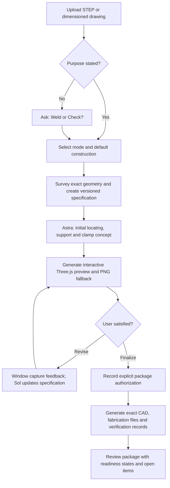

# Backwell IXL fixture skills

Reusable CAD workflows for designing, reviewing and validating manufacturing fixtures from STEP geometry or dimensioned drawings.

## Recommended skill

| Skill | Folder | Purpose |
|---|---|---|
| **Design Fixture** | [design-fixture](design-fixture/SKILL.md) | One self-contained workflow for weld and checking fixtures, with a measured concept, interactive Three.js preview, revision loop and explicitly authorized final package. |

### Supported modes

| Fixture purpose | Default construction | Explicit alternative |
|---|---|---|
| Weld fixture | `laser_rib` — 5 mm laser-cut tab-and-slot construction | `block` — explicit machined/welded block CAD workflow |
| Check fixture | `laser_rib` — 5 mm laser-cut checking ribs | `printed_solid` — solid plastic checking body |

Unsupported weld + printed-solid and checking + block combinations may be explored only as clearly recorded concept exceptions. The skill does not finalize them as normal delivery modes.

## Workflow

The skill stops after the preview by default. It does not create nesting, fabrication DXF or a complete delivery package until the user explicitly asks to **finalize**, **approve**, or **complete the package**. That request authorizes package generation only; it is not engineering or fabrication approval.

### Model handoff

- **Astra** is recommended for the initial fixture concept, datum strategy, locating scheme and difficult accessibility decisions.
- **Sol** is recommended for specification revisions, preview regeneration, deterministic checks and final packaging.
- Model switching is not automatic. `spec.json` and `project.json` preserve source hashes, units, coordinate frame, stable component IDs, decisions, evidence, open items and revision state so another model or fresh chat can resume safely.

## Preview and revision

The concept stage derives lightweight named meshes from the evaluated OCP geometry and produces:

- Interactive Three.js rotate, pan and zoom
- Isometric, front, right and top camera presets
- Workpiece, fixture and hardware visibility controls
- Clickable component IDs and project/revision labels
- Comment mode: numbered pins anchored to clicked points, each recording the component ID
- Copy snapshot / Save PNG: the pins and their text burned into the rendered frame
- Two CAD-rendered PNG fallbacks

The Three.js mesh is for design review, not measurement. Exact gaps, intersections, clearances and exported geometry remain the responsibility of the OCP CAD pipeline. Interactive preview requires access to the pinned Three.js CDN; PNG fallback remains available when WebGL, inline HTML or the CDN is unavailable.

## Final outputs

| Mode | Delivery |
|---|---|
| Weld + laser ribs | Nested fabrication DXF, named assembly STEP, two review PNGs and four JSON records |
| Weld + blocks | Explicit block CAD/manufacturing workflow; not forced through the automated rib builder |
| Check + laser ribs | Fabrication DXF, checking assembly STEP, review PNGs, checking/gauge evidence and JSON records |
| Check + printed solid | STEP/STL print geometry, review PNGs, checking/gauge evidence and JSON records |

Checking fixtures retain the Backwell IXL shop defaults: **3.0 mm nominal flange gap, 2.5 mm GO enters and 3.5 mm NO-GO does not enter**. Gauge access includes the working end, stem, handle and operator hand with the part restrained.

## Installation and use

Copy or install the complete inner [`design-fixture`](design-fixture/) folder into the assistant's skills directory. Keep `SKILL.md`, `scripts`, `references`, `assets`, `examples`, `tests` and `agents` together.

For local script use, install [`scripts/requirements.txt`](design-fixture/scripts/requirements.txt) in a suitable Python environment. The tested CAD kernel is OCP 7.8.1.1 and the supported range is OCP 7.8.x.

Once installed, the skill is self-contained and does not pull code from GitHub. Example `workpiece.step` models are deterministic software test coupons, not production parts or templates to scale.

## Versions

Each known-good state of this repository is tagged. Browse them under [Tags](../../tags), or restore one with `git checkout <tag> -- design-fixture/`.

| Tag | State |
|---|---|
| [`v1.2.2`](../../tree/v1.2.2) | Current. Click-to-comment pins and a snapshot button in the datum-scheme review and the concept preview. Comments are review notes only and never edit the spec. |
| [`v1.2.1`](../../tree/v1.2.1) | Removes a duplicate nested copy of the skill folder left by an earlier upload. |
| [`v1.2`](../../tree/v1.2) | Cap tab-and-slot joints are generated by default: every supported clamp and pin-carrier cap receives two separated locating tabs without hand-authoring, and the 10 mm material-width audit now also runs during the concept preview. 133 tests pass. |
| [`v1.1`](../../tree/v1.1) | Previous published state. Predates the generated cap joints and the datum-scheme preview. |

Tag a new version only when `python -m unittest discover -s tests -v` passes in `design-fixture/`.

## Legacy skills

The earlier separate skills are retained as regression baselines and for backward compatibility. Use **Design Fixture** for new projects.

| Legacy skill | Folder |
|---|---|
| Design Check Fixture | [design-check-fixture](design-check-fixture/SKILL.md) |
| Design Weld Fixture v8 | [design-weld-fixture-v8](design-weld-fixture-v8/SKILL.md) |

## Engineering status

`cad_verified`, `fabrication_ready`, `fixture_calibrated` and `inspection_validated` remain separate states. A complete review package can still contain unknowns or open decisions and must not be described as production-ready until the relevant engineering, physical calibration and trial evidence exists.
