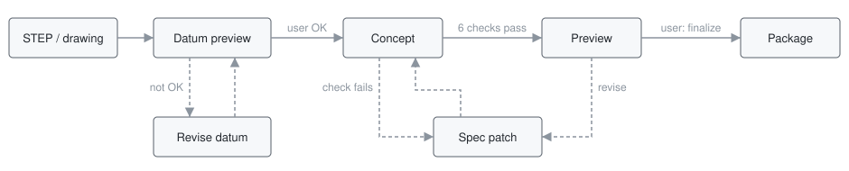
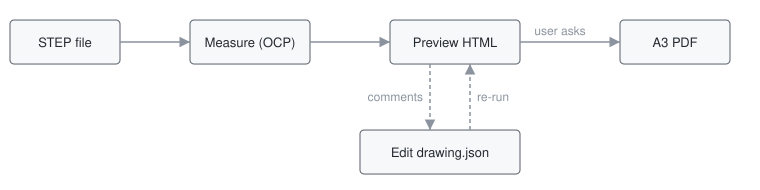
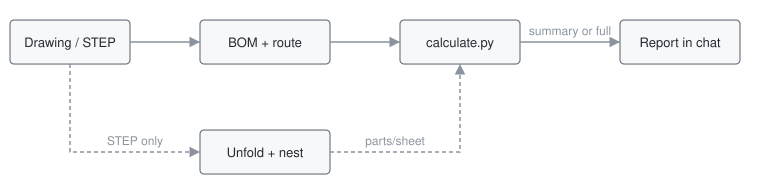
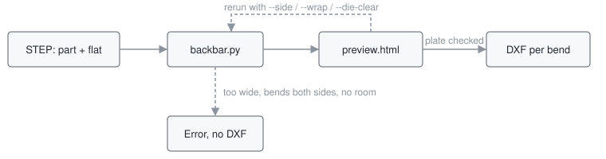
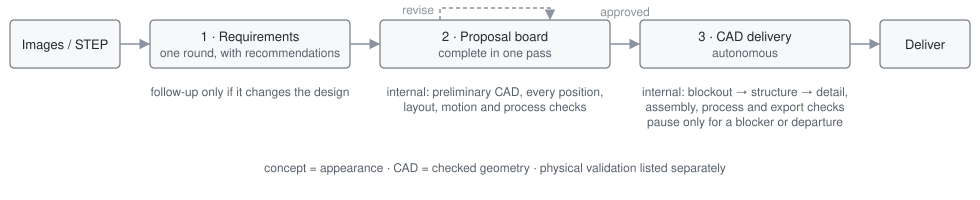

# BIXL Skills

Backwell IXL assistant skills. Each [release](../../releases) carries one skill as a zip with `SKILL.md` at its root, ready to upload to an assistant; unzip it into a named folder to install locally.

| Skill | Purpose |
|---|---|
| [design-fixture](#design-fixture) | Weld and checking fixtures from a STEP file or dimensioned drawing |
| [draft-drawing](#draft-drawing) | Draft A3 shop drawing of a sheet-metal part or weldment from a STEP file |
| [costing](#costing) | Sheet-metal fabrication cost estimate from a drawing or STEP file |
| [design-backbar](#design-backbar) | Laser-cut backgauge jig plates for bends where the blank edge is not parallel to the bend |
| [design-engineer](#design-engineer) | Product ideas, photos, sketches or STEP parts into visual models or dimensioned CAD |

## design-fixture

[SKILL.md](design-fixture/SKILL.md) · local scripts need [`scripts/requirements.txt`](design-fixture/scripts/requirements.txt) (OCP 7.8.x)

**[Download design-fixture-v1.6.zip](../../releases/download/design-fixture-v1.6/design-fixture-v1.6.zip)** — `SKILL.md` at the zip root; unzip into a folder named `design-fixture`.

The checks: cap tabs, rib width, cross ribs, clamp plate size, straight unload, pin clearance, brace merge, flange coverage (checking fixtures). A failed check stops the concept with no preview.

Default construction is 5 mm laser-cut tab-and-slot ribs. Blocks (weld) and printed solid (check) are explicit alternatives. Finalizing generates the package; it is not engineering approval.

## draft-drawing

[SKILL.md](draft-drawing/SKILL.md) · local scripts need [`scripts/requirements.txt`](draft-drawing/scripts/requirements.txt) (OCP 7.8.x, matplotlib)

**[Download draft-drawing-v1.3.zip](../../releases/download/draft-drawing-v1.3/draft-drawing-v1.3.zip)** — `SKILL.md` at the zip root; unzip into a folder named `draft-drawing`.

STEP file in, measured numbers out: overall size, flanges, bends, hole and slot positions, and total steel weight. Every number comes from exact OCP geometry, never a picture.

`workflow.py preview` writes a single self-contained `preview.html` (3D plus one tab per sheet) with comment pins. Comments are applied by editing `drawing.json` and re-running the preview. The A3 PDF is only generated on an explicit request, and `finalize` refuses if the STEP or settings changed since the last preview. What is not measured — flat pattern, tolerances, GD&T, welds, threads — is listed as NOT DIMENSIONED, never passed off as checked.

## costing

[SKILL.md](costing/SKILL.md) · `calculate.py` is standard-library Python; STEP geometry and nesting need [`scripts/requirements.txt`](costing/scripts/requirements.txt) (OCP 7.8.x, shapely, scipy, matplotlib)

**[Download costing-v1.3.zip](../../releases/download/costing-v1.3/costing-v1.3.zip)** — `SKILL.md` at the zip root; unzip into a folder named `costing`.

Drawing in, internal budget estimate out: per-part laser, bend, weld and finish costs, IXL baseline material pricing, and a selling price at 28% gross margin. AUD ex GST. Every total comes from `calculate.py`; unknown costs stay Unpriced, never zero. It is a budget estimate, not a supplier quotation.

## design-backbar

[SKILL.md](design-backbar/SKILL.md) · scripts in `scripts/`; they need `cadquery-ocp` 7.8.x, `ezdxf` and `numpy` (installed by `uv run`, see the skill)

**[Download design-backbar-v1.4.zip](../../releases/download/design-backbar-v1.4/design-backbar-v1.4.zip)** — `SKILL.md` at the zip root; unzip into a folder named `design-backbar`.

STEP of the formed part in (a supplied flat pattern is used if present, otherwise the flat is estimated by unfolding at K=0.50), one DXF per plate out. Bends with a genuinely parallel edge are gauged directly with no plate. Otherwise a 100 × 6 mm plate over the LVD backgauge finger with a pocket cut to the blank outline + 0.1 mm, so a slanted blank edge gauges square on a blank cut without tabs. Parallel bends gauged from the same end share one plate. For CADMAN-B it also writes the folded part as a STEP with a 5 mm gauge tab whose edge lies on the blank-tip line; the tab exists only in that STEP. The preview takes pinned review comments. Numbers come from exact OCP geometry, except an estimated unfold. Die, punch and flange collisions, backgauge reach and the full bend sequence are not checked. A part that does not fit the standard plate is an error, not a resized plate. Edges are trimmed only on explicit request.

## design-engineer

[SKILL.md](design-engineer/SKILL.md) · `surface_from_grid.py` and the stage-preview generator `preview.py` need [`scripts/requirements.txt`](design-engineer/scripts/requirements.txt) (build123d 0.13, OCP 8.0, scipy, Pillow)

**[Download design-engineer-v1.4.zip](../../releases/download/design-engineer-v1.4/design-engineer-v1.4.zip)** — `SKILL.md` at the zip root; unzip into a folder named `design-engineer`.

References, ideas or an existing STEP in; an editable build123d model, a Blender visual model, or both, out. Geometry and appearance are reviewed as separate tracks, and estimated dimensions are labelled as estimates. A valid solid or a good render is not a manufacturability check.
